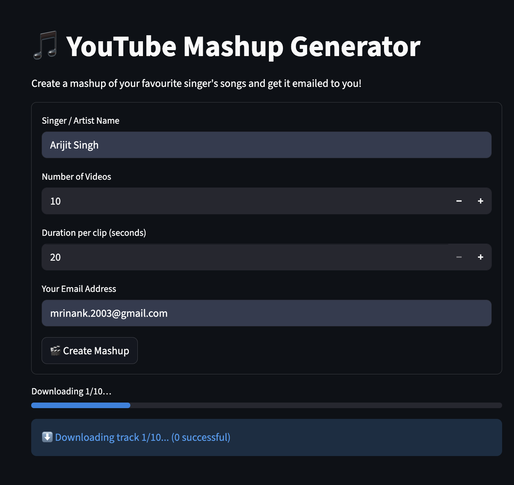

# 🎵 YouTube Mashup Generator

**Roll Number:** 102303235 | **Author:** Mrinank Jit Singh

Transform your favorite artist's songs into seamless mashups! This Python application automatically downloads, processes, and combines YouTube music tracks into a single MP3 file.


*Web interface showing the mashup creation process*

## ✨ Features

- 🎯 **Smart Search**: Automatically finds YouTube videos for any artist
- ✂️ **Intelligent Trimming**: Extracts the best parts of each song
- 🔄 **Seamless Merging**: Creates smooth transitions between tracks  
- 📧 **Email Delivery**: Sends completed mashups directly to your inbox
- 🖥️ **Dual Interface**: Both web app and command-line versions
- ⚡ **Fast Processing**: Optimized download and audio processing

## 🚀 Demo

### Web Application
Launch the interactive Streamlit interface:
```bash
streamlit run app.py
```

### Command Line
Quick mashup generation:
```bash
python 102303235.py "Arijit Singh" 10 20 my-mashup.mp3
```

## 🛠️ Tech Stack

| Component | Technology |
|-----------|-----------|
| **Backend** | Python 3.8+ |
| **Web Framework** | Streamlit |
| **Audio Processing** | PyDub + FFmpeg |
| **YouTube Integration** | yt-dlp |
| **Email Service** | SMTP (Gmail) |

## 📋 Prerequisites

### Required Software
- **Python 3.8+** 
- **FFmpeg** (for audio processing)

### FFmpeg Installation
```bash
# macOS
brew install ffmpeg

# Ubuntu/Debian
sudo apt update && sudo apt install ffmpeg

# Windows (with Chocolatey)
choco install ffmpeg
```

## ⚙️ Setup & Installation

### 1. Clone Repository
```bash
git clone https://github.com/mrinank03/MashUp-Python.git
cd MashUp-Python
```

### 2. Create Virtual Environment
```bash
python -m venv venv

# Activate virtual environment
source venv/bin/activate        # macOS/Linux
# OR
venv\Scripts\activate          # Windows
```

### 3. Install Dependencies
```bash
pip install -r requirements.txt
```

### 4. Configure Environment (Optional)
For email functionality, create a `.env` file:
```env
EMAIL_ADDRESS=your-email@gmail.com
EMAIL_PASSWORD=your-app-password
```

> **Note:** Use Gmail App Passwords, not your regular password

## 📱 Usage Guide

### 🌐 Web Application

1. **Start the server:**
   ```bash
   streamlit run app.py
   ```

2. **Open your browser** to the displayed URL (typically `http://localhost:8501`)

3. **Fill in the form:**
   - Enter artist/singer name
   - Set number of videos (5-20)
   - Choose clip duration (20-60 seconds)
   - Provide your email address

4. **Click "Create Mashup"** and wait for processing

5. **Check your email** for the completed mashup!

### 💻 Command Line Interface

```bash
python 102303235.py "<Artist>" <Videos> <Duration> <Output>
```

**Parameters:**
- `<Artist>`: Singer or artist name (in quotes)
- `<Videos>`: Number of videos to download (integer)
- `<Duration>`: Seconds per clip (integer) 
- `<Output>`: Output filename (must end with .mp3)

**Examples:**
```bash
# Generate 20-second clips from 15 Arijit Singh songs
python 102303235.py "Arijit Singh" 15 20 arijit-mashup.mp3

# Create a 30-second mashup from 8 AR Rahman tracks  
python 102303235.py "AR Rahman" 8 30 rahman-mix.mp3
```

## 📁 Project Structure

```
YouTube-Mashup-Generator/
├── 📄 app.py                 # Streamlit web application
├── 📄 102303235.py          # Command-line tool
├── 📄 requirements.txt      # Python dependencies
├── 📄 .gitignore           # Git exclusions
├── 📄 .env                 # Environment variables (create this)
└── 📄 README.md            # This file
```

## 🔧 How It Works

1. **Search**: Queries YouTube for artist's songs using yt-dlp
2. **Download**: Fetches audio tracks with multiple fallback formats
3. **Process**: Extracts specified duration from each track's beginning
4. **Merge**: Combines all clips into a seamless mashup
5. **Deliver**: Packages as MP3 and sends via email (web app)

## ⚠️ Important Notes

- **Copyright**: This tool is for educational purposes only
- **Rate Limits**: Includes delays to respect YouTube's policies  
- **Dependencies**: Requires stable internet connection
- **File Size**: Large mashups may take time to email

## 🐛 Troubleshooting

### Common Issues

**FFmpeg not found:**
```bash
# Verify installation
ffmpeg -version

# Add to PATH if needed (Windows)
set PATH=%PATH%;C:\path\to\ffmpeg\bin
```

**Download failures:**
- Check internet connection
- Try different artist names
- Reduce number of videos

**Email not working:**
- Verify Gmail App Password
- Check .env file configuration
- Ensure less secure app access is enabled


